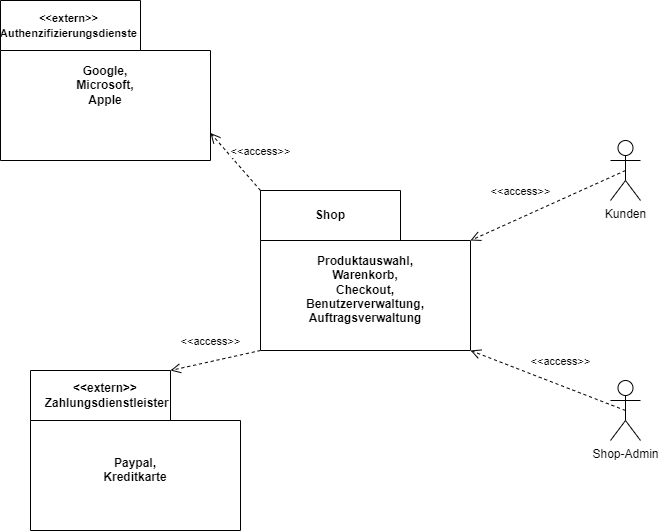
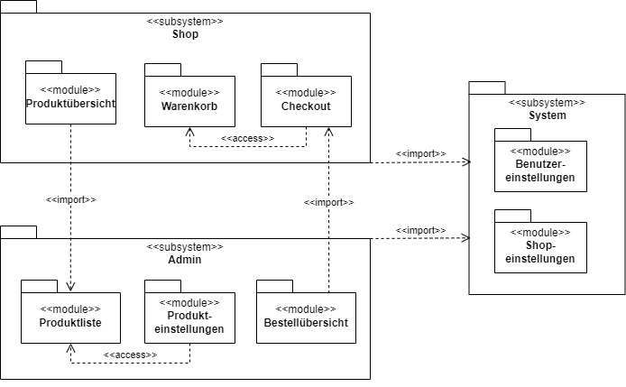
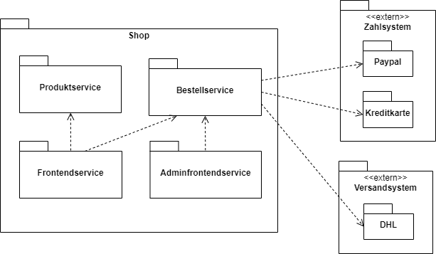
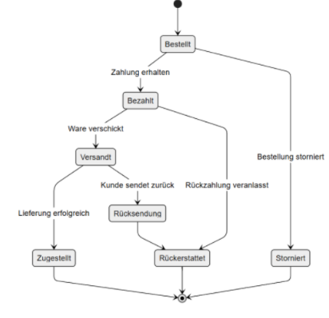
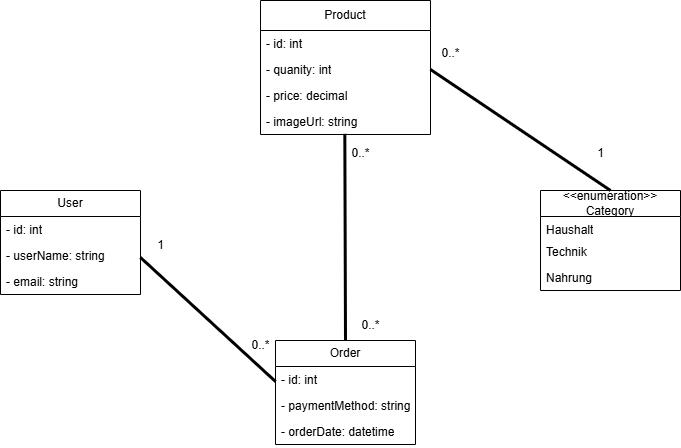
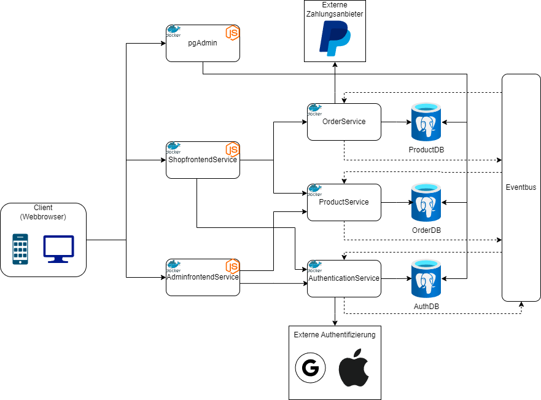

#

**Über arc42**

arc42, das Template zur Dokumentation von Software- und
Systemarchitekturen.

Template Version 8.2 DE. (basiert auf AsciiDoc Version), Januar 2023

Created, maintained and © by Dr. Peter Hruschka, Dr. Gernot Starke and
contributors. Siehe <https://arc42.org>.

# Einführung und Ziele 

## Aufgabenstellung 

Ziel ist es, eine moderne, benutzerfreundliche und leistungsfähige E-Commerce-Plattform bereitzustellen, die ein optimales Einkaufserlebnis für Kundinnen und Kunden bietet und gleichzeitig die internen Betriebsabläufe effizient unterstützt.
Die vollständige Konzeption und Umsetzung des neuen Systems erfolgt durch ein internes Softwareentwicklungsteam. Externe Partner oder Dienstleister sind in diesen Prozess nicht eingebunden.
Das neue System soll alle zentralen E-Commerce-Funktionen abdecken. Dazu gehören unter anderem die Nutzerregistrierung und -verwaltung, eine leistungsstarke Produktsuche, Warenkorbfunktionen, ein durchgängiger Checkout-Prozess, Bestellbestätigungen sowie ein administrativer Bereich zur Artikelpflege und zur Verwaltung von Bestellungen.
Technisch wird das System plattformunabhängig und hoch skalierbar konzipiert, um auch bei stark schwankender Last zuverlässig zu funktionieren. Der Betrieb erfolgt in einer Azure-basierten Cloud-Infrastruktur, um eine hohe Verfügbarkeit sowie einfache Wartung und Erweiterbarkeit zu gewährleisten.

## Projektziele 

Die Projektziele finden sich im [hier](https://github.com/Snooze-Choose/Projektmanagement/issues?q=is%3Aissue%20state%3Aopen%20label%3Aepic).

## Stakeholder 

## Stakeholder-Tabelle

| Name             | Rolle           | Interesse am Projekt                             | Einfluss auf das Projekt | Erwartungshaltung                                            |
| ---------------- | --------------- | ------------------------------------------------ | ------------------------ | ------------------------------------------------------------ |
| Christoph Loeser | Auftraggeber    | Erfolgreiche Umsetzung im Budget und Zeitrahmen  | Hoch                     | Transparente Kommunikation, Einhaltung von Budget & Terminen |
| Max Mustermann   | Kunden          | Benutzerfreundliches und funktionales Endprodukt | Mittel                   | Hohe Qualität, intuitive Bedienung, schneller Support        |
| IT-Team          | Administratoren | Stabile, wartbare und sichere Systemumgebung     | Gering                   | Technische Dokumentation, einfache Wartbarkeit, Sicherheit   |

# Randbedingungen 

## Technische Randbedingungen 

| Komponente        | Technologie           |
| ----------------- | --------------------- |
| Backend           | C# .NET Web API Core  |
| ORM               | Entity Framework Core |
| Datenbank         | PostgreSQL            |
| Frontend          | TypeScript + Vue.js   |
| Service Discovery | .NET Aspire           |
| Containerisierung | Docker                |

## Organisatorische Randbedingungen 

Die Entwicklung des Systems erfolgt nach dem Scrum-Vorgehensmodell.
Sprints haben eine feste Dauer von zwei Wochen.
Rollen wie Product Owner, Scrum Master und Entwicklungsteam sind definiert und besetzt.
Die Sprintplanung, Reviews und Retrospektiven finden regelmäßig gemäß dem Scrum-Framework statt.

# Kontextabgrenzung 

Zur präzisen Definition der fachlichen Kontextabrenzung wurde ein UML-Diagramm erstellt, welches sämtliche Kommunikationsbeziehungen mit dem System festlegt.

Im Mittelpunkt steht die Komponente „Shop“, die die zentralen Funktionalitäten umfasst. Dazu gehören:

Produktauswahl,

Warenkorb,

Checkout (Bezahlvorgang),

Benutzerverwaltung und

Auftragsverwaltung.

Diese Shop-Komponente wird von verschiedenen externen Akteuren genutzt oder unterstützt:

1. Kunden
Kunden sind typische Endnutzer des Shops. Sie greifen über eine <<access>>-Beziehung auf das System zu, um Produkte auszuwählen, in den Warenkorb zu legen, zu bezahlen und Bestellungen zu verwalten.

2. Shop-Admin
Der Shop-Administrator greift ebenfalls auf den Shop zu, allerdings meist mit erweiterten Rechten. Der Admin übernimmt Aufgaben wie das Verwalten von Benutzerkonten, Produkten oder Bestellungen.

3. Authentifizierungsdienste (extern)
Externe Anbieter wie Google, Microsoft oder Apple bieten Authentifizierungsdienste an. Der Shop greift auf diese Dienste zu (<<access>>), um eine sichere Anmeldung der Benutzer über bestehende Konten zu ermöglichen (z. B. „Login mit Google“).

4. Zahlungsdienstleister (extern)
Auch Zahlungsdienste wie PayPal oder Kreditkartenanbieter sind externe Systeme, mit denen der Shop kommuniziert. Diese werden beim Checkout-Prozess eingebunden, um Zahlungen sicher und reibungslos abzuwickeln.

# Bausteinsicht 

## Whitebox Gesamtsystem 

Diese Ansicht dient dazu, die wesentlichen Subsysteme und deren Beziehungen untereinander sichtbar zu machen.

Das Gesamtsystem ist in drei zentrale Subsysteme gegliedert:

- Shop
- Admin
- System

Jedes dieser Subsysteme enthält mehrere Module, die bestimmte fachliche oder technische Aufgaben übernehmen.

### Subsystem "Shop":

Dieses Subsystem bildet die Kernfunktionen des Onlineshops ab. Es besteht aus den Modulen:

Produktübersicht: Zeigt Produkte für Endkunden an.
Warenkorb: Ermöglicht das Sammeln von Produkten vor dem Kauf.
Checkout: Abwicklung des Kaufprozesses.

Zwischen den Modulen bestehen Zugriffsbeziehungen:
Das Modul „Warenkorb“ greift auf die „Produktübersicht“ zu, während der „Checkout“ wiederum auf den „Warenkorb“ zugreift.

### Subsystem "Admin":

Das Admin-Subsystem stellt Funktionen für die Verwaltung des Shops bereit. Es beinhaltet:

Produktliste: Verwaltung und Anzeige aller Produkte.
Produkteinstellungen: Konfiguration einzelner Produkte.
Bestellübersicht: Einsicht in Bestellungen.

Auch hier gibt es interne Zugriffsbeziehungen:
Das Modul „Produkteinstellungen“ greift auf die „Produktliste“ zu.

### Subsystem "System"

Dieses Subsystem enthält systemweite Konfigurationsmöglichkeiten:

Benutzereinstellungen: Verwaltung nutzerspezifischer Einstellungen.
Shop-Einstellungen: Zentrale Konfigurationen für den gesamten Shop.

Subsystem-übergreifende Beziehungen
Es existieren mehrere Import-Beziehungen zwischen den Subsystemen, welche die Abhängigkeiten und Schnittstellen-Nutzungen darstellen:

Das Subsystem Shop importiert Funktionalitäten aus dem Subsystem System (z. B. Einstellungen).
Auch das Subsystem Admin nutzt zentrale Funktionen des Subsystems System.
Darüber hinaus importiert Shop auch Bestandteile aus dem Subsystem Admin, insbesondere im Zusammenhang mit Produktdaten.

## Blackbox Gesamtsystem 

Die Abbildung des Blackbox Gesamsystem stellt die Blackbox-Sicht auf das Subsystem „Shop“ dar. In dieser Sichtweise wird das System als abgegrenzte Einheit betrachtet, deren interne Struktur nur grob sichtbar ist. Der Fokus liegt vielmehr auf den externen Schnittstellen, den beteiligten Nachbarsystemen sowie den grundlegenden Funktionseinheiten innerhalb des Shops.

Das Shopsystem bildet den Kern des Gesamtsystems und ist verantwortlich für alle zentralen Geschäftsprozesse wie die Produktverwaltung, die Bestellabwicklung und die Bereitstellung von Benutzer- und Admin-Oberflächen. Es setzt sich intern aus vier Hauptkomponenten zusammen:

Produktservice: Verantwortlich für die Verwaltung und Bereitstellung von Produktinformationen.
Bestellservice: Kümmert sich um die Annahme, Verarbeitung und Koordination von Bestellungen.
Frontendservice: Stellt die Benutzeroberfläche für Endkunden zur Verfügung.
Adminfrontendservice: Bietet Verwaltungsoberflächen für Administratoren.

Diese internen Services kommunizieren untereinander, wobei beispielsweise der Frontendservice auf den Produktservice zugreift und der Adminfrontendservice mit dem Bestellservice interagiert.
Darüber hinaus steht das Shopsystem in Verbindung mit mehreren externen Systemen, die über definierte Schnittstellen eingebunden sind:

Ein Zahlsystem, bestehend aus den Modulen Paypal und Kreditkarte, wird vom Bestellservice angesprochen, um Zahlungen abzuwickeln.
Ein Versandsystem, hier repräsentiert durch den Anbieter DHL, wird ebenfalls vom Bestellservice genutzt, um Versandprozesse auszulösen.

Die externen Systeme liegen außerhalb des Shops, sind jedoch über wichtige Schnittstellen in die Geschäftsprozesse integriert.

# Laufzeitsicht 

## Zustände der Bestellung 

Das dargestellte Zustandsdiagramm zeigt die Laufzeitsicht einer Bestellung im System. Es beschreibt die dynamischen Verhaltensweisen und Zustandsänderungen einer Bestellung im Verlauf ihres Lebenszyklus von der Erfassung bis zum endgültigen Abschluss.

Eine Bestellung beginnt im Zustand „Bestellt“, nachdem der Kunde eine Bestellung im System ausgelöst hat. Nach erfolgreichem Zahlungseingang wechselt die Bestellung in den Zustand „Bezahlt“. Anschließend wird die Ware versendet, wodurch die Bestellung in den Zustand „Versandt“ übergeht. Kommt die Ware beim Kunden an, ist der Zustand „Zugestellt“ erreicht, was den regulären Abschluss eines Bestellvorgangs darstellt.

Parallel dazu sind jedoch auch abweichende Abläufe möglich: Der Kunde kann die Bestellung stornieren, was direkt zum Zustand „Storniert“ führt. Wird die Bestellung zwar bezahlt, aber vom Kunden zurückgesendet, so geht sie zunächst in den Zustand „Rücksendung“ über. Nach erfolgreicher Bearbeitung der Rücksendung und Einleitung der Rückzahlung wird die Bestellung schließlich in den Zustand „Rückerstattet“ überführt.

Der finale Abschluss des Prozesses erfolgt in einem Endzustand, der sowohl von einer erfolgreichen Zustellung als auch von einer Stornierung oder Rückerstattung erreicht werden kann.

Diese Laufzeitsicht ermöglicht ein klares Verständnis über die möglichen Abläufe und Alternativen innerhalb des Bestellprozesses.

## Klassenbibliothek

Das Klassendiagramm stellt ein einfaches System zur Verwaltung von Bestellungen und Produkten dar. Es umfasst die Klassen User, Order und Product sowie eine Enumeration Category.

Ein User (Benutzer) besitzt eine eindeutige ID, einen Benutzernamen und eine E-Mail-Adresse. Jeder Benutzer kann null oder mehrere Bestellungen aufgeben. Diese Beziehung wird durch die Verbindung zwischen User und Order dargestellt, wobei ein Benutzer mit beliebig vielen Bestellungen verbunden sein kann. Umgekehrt gehört jede Bestellung genau einem Benutzer.

Die Klasse Order (Bestellung) enthält ebenfalls eine eindeutige ID, die verwendete Zahlungsmethode sowie das Datum der Bestellung. Eine Bestellung kann aus mehreren Produkten bestehen, und ein Produkt kann wiederum in mehreren Bestellungen enthalten sein. Daraus ergibt sich eine n:m Beziehung zwischen den Klassen Order und Product.

Ein Product (Produkt) ist durch eine ID, eine Mengenangabe, einen Preis und eine Bild-URL beschrieben. Jedes Produkt gehört genau einer Category (Kategorie) an. Die Kategorie ist als Enumeration dargestellt und umfasst die Werte „Haushalt“, „Technik“ und „Nahrung“. Ein Produkt kann keiner oder mehreren Bestellungen zugeordnet sein, gehört jedoch immer genau einer dieser Kategorien an.

# Verteilungssicht 

Das Architekturdiagramm stellt eine Microservice-Architektur für das webbasierte Shopsystem dar. Es zeigt die verschiedenen Komponenten, wie sie miteinander interagieren, und welche externen Dienste eingebunden sind.

Ein Client, also ein Webbrowser auf einem Computer oder mobilen Gerät, greift auf zwei verschiedene Frontend-Dienste zu. Einmal den ShopfrontendService für Kunden und den AdminfrontendService für Administratoren. Beide Dienste laufen in Docker-Containern und basieren auf Node.js.

Der ShopfrontendService kommuniziert mit dem ProductService, um Produktinformationen bereitzustellen, und mit dem OrderService, um Bestellungen aufzugeben. Diese Services greifen jeweils auf ihre eigenen Datenbanken zu. Der ProductService auf die ProductDB und der OrderService auf die OrderDB.

Zudem ist ein AuthenticationService vorhanden, der ebenfalls in einem Docker-Container läuft und Benutzer authentifiziert. Dieser Service nutzt die AuthDB zur Speicherung von Nutzerdaten und kann auch externe Authentifizierungsdienste wie Google und Apple einbinden.

Der OrderService ist zudem mit einem externen Zahlungsanbieter, hier symbolisiert durch PayPal, verbunden, um Zahlungen abzuwickeln.

Für Verwaltungs- und Analysezwecke steht außerdem ein pgAdmin zur Verfügung, das ebenfalls in einem Container läuft und auf die Datenbanken zugreifen kann.

Alle Microservices, OrderService, ProductService und AuthenticationService, kommunizieren untereinander über einen Eventbus. Über diesen Eventbus können Änderungen und Ereignisse systemweit verteilt und verarbeitet werden, z. B. wenn eine neue Bestellung erstellt oder ein Produkt aktualisiert wird.

# Querschnittliche Konzepte 

## Agiles Entwicklungskonzept 

Die Software soll innerhalb eines agilen Entwicklungskonzepts entwickelt werden. Für die Umsetzung der zuvor genannten Anforderungen werden Rollen benötigt, die die folgenden Funktionen erfüllen: Produktowner, Entwickler und Teamleiter. Die Verantwortung für die Definition der zu verarbeitenden Informationen im Rahmen des Auftrags obliegt dem Produkt Owner. Das Verfahren basiert auf der Durchführung von Sprints. Zu Beginn des Entwicklungsprozesses ist eine sorgfältige Planung des Sprints erforderlich, in dessen Verlauf der Teamleiter die Aufgaben an die Entwickler weiterleitet. Im Anschluss werden die Aufgaben von den Entwicklern erledigt und die Ergebnisse besprochen. Während des Sprints finden Meetings statt, in denen der Austausch der aktuellen Stände erfolgt. In der Konsequenz resultiert daraus ein effektives und effizientes System.

# Risiken und technische Schulden 

### Risiko: Geringe Nutzerakzeptanz des Shops

- **Beschreibung:** Es besteht das Risiko, dass der entwickelte Shop von der Zielgruppe nicht wie erwartet angenommen wird. Mögliche Ursachen können eine unzureichende Nutzerführung, fehlende Funktionen, mangelnde Performance oder ein nicht zielgruppengerechtes Design sein.
- **Auswirkungen:** Geringe Nutzerzahlen, niedrige Conversion-Rate, wirtschaftlicher Misserfolg des Produkts. Hoher Anpassungsaufwand nach dem Go-live zur Nachbesserung.
- **Gegenmaßnahmen:**
  - Frühzeitige Einbindung von Endnutzern durch Usability-Tests und Feedbackzyklen (z. B. Prototypentests, A/B-Tests).
  - Iterative Entwicklung mit MVP-Ansatz und klar definierten Akzeptanzkriterien.
  - Analyse von Konkurrenzprodukten und Nutzerverhalten.
- **Technische Schulden:** Möglicherweise müssen grundlegende Architektur- oder Designentscheidungen überarbeitet werden, falls sich im Live-Betrieb fundamentale Nutzungsprobleme zeigen. Dies kann zu erhöhtem Refactoring-Aufwand führen.

